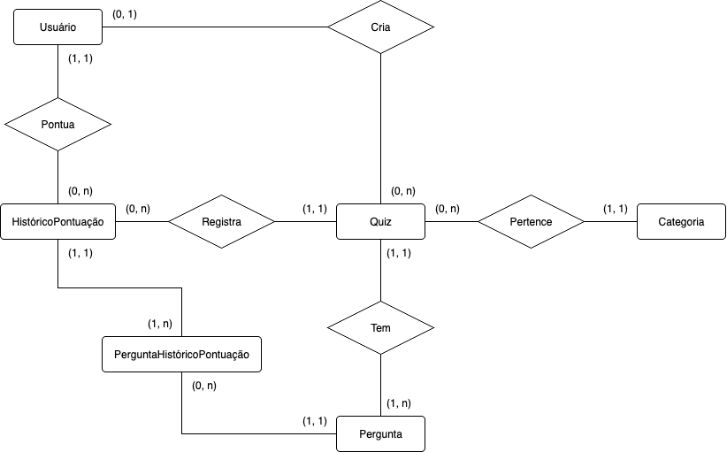
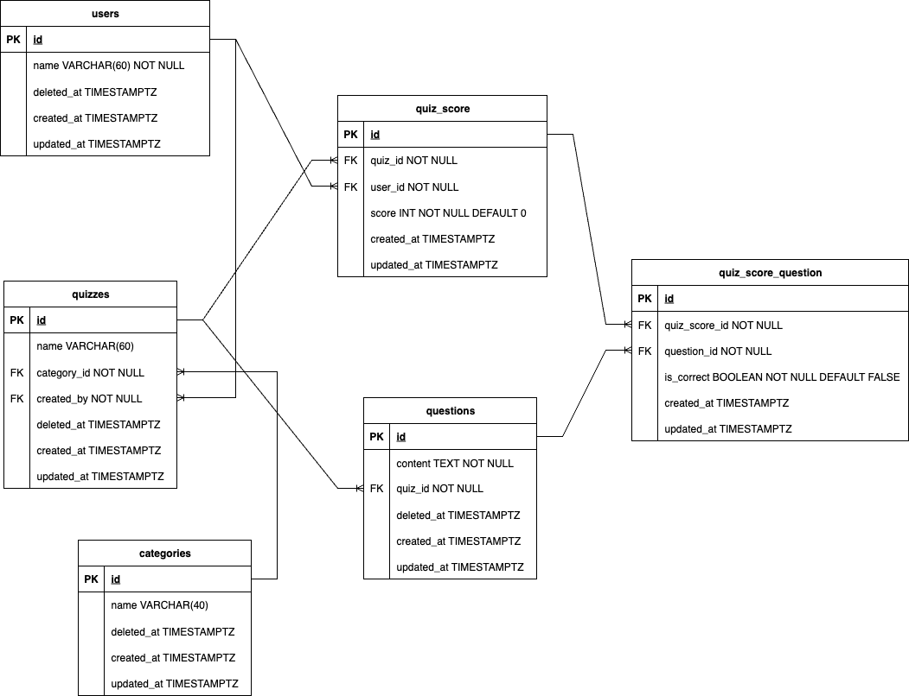

# IntelliQuiz 📝 🤖

## Objetivo

O IntelliQuiz é uma aplicação onde propõe a criação de quizzes utilizando do auxílio de inteligência artificial, com recursos de geração ou autocompletagem de perguntas.

A aplicação também apresenta um sistema de autenticação pelo Firebase, controlando o uso da plataforma e registrando dados dos usuários.

## Objetivo do código-fonte feito por cada integrante

### Yan

- Criação do back-end com seus endpoints para integração futura ao front-end
- Setup do banco de dados e sua integração ao back-end
- Desenvolvimento da modelagem do banco de dados para criação das entidades no GORM

### Julia 
- ⁠Criação do Front-end
- ⁠Desenvolvimento da interface do usuário utilizando boas práticas de design responsivo e acessibilidade.
- ⁠Estruturação de páginas e fluxos principais com foco em experiência do usuário (UX).
- ⁠Prototipagem
- ⁠Criação de protótipos funcionais para validação de ideias e fluxos antes da implementação final.
- ⁠Utilização de ferramentas de prototipagem para acelerar a tomada de decisão junto ao time.
- ⁠Criação de Componentes
- ⁠Desenvolvimento de componentes reutilizáveis para padronizar a aplicação e otimizar a manutenção do código.
- ⁠Implementação seguindo guidelines de design system e boas práticas de componentização.
- ⁠Conexão com o Back-end
- ⁠Integração do front-end com APIs e serviços back-end.
- ⁠Consumo de dados e tratamento de estados da aplicação.
- ⁠Garantia da comunicação eficiente entre front-end e back-end, com foco em segurança e performance.

## Stack utilizada

**Front-end:**
- NextJS (React)
- TailwindCSS

**Back-end:**
- Go 1.24.6
- Gin Framework
- GORM

**Banco de Dados:**
- PostgreSQL 17

**Arquitetura da Aplicação:**
- REST
- MVC (Model-View-Controller)

**Containerização:**
- Docker com Docker Compose
- Front-end e back-end conectados via network
## Rodando localmente

O projeto utiliza Docker Compose para facilitar a configuração e execução da aplicação, desta forma inicialmente é necessário a clonagem do repositório localmente:

```bash
  git clone https://link-para-o-projeto
```

Entrar no diretório do projeto:

```bash
  cd my-project
```

E iniciar o criar/iniciar o contâiner da aplicação back-end:

```bash
docker-compose up --build
```

Desta maneira, a aplicação será executada na porta 8080 e o banco PostgreSQL na porta 5432.
## Documentação

### Diagrama Relacional Inicial


### Diagrama Lógico


